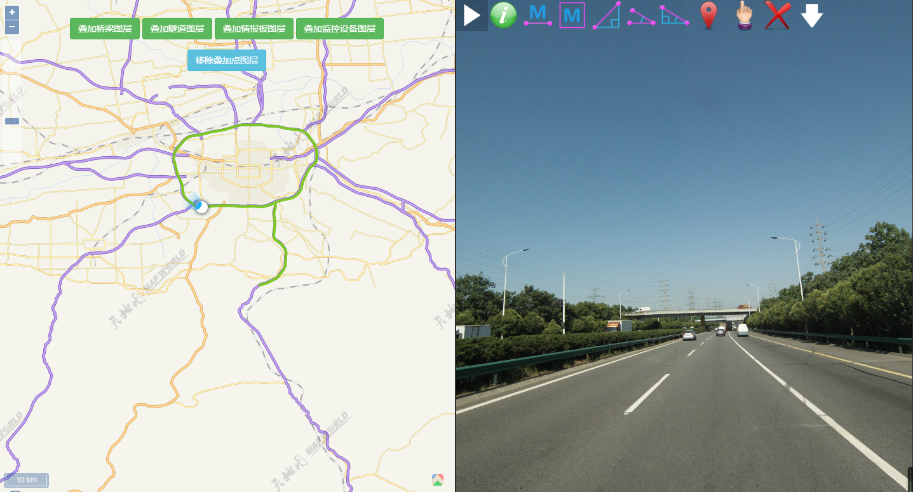

# 插件相关

## 简介
PPVision 客户端是基于 HTML5 技术的实景、全景组件，该控件可访问 PPVisionServer 发布的全景或可测量影像资源，同时也提供了在图像上进行空间采集与量测的功能，开发人员可以轻易地将该控件嵌入到基于 Web 应用的网页系统

> 主要功能
> - 浏览全景或可测量影像
- 空间三维量测
- 空间三维定位

## 安装与部署

直接在页面引入即可

```html
<script type="text/javascript" src="../dist/js/ppv.min.js"></script>
<!--页面dom结构必须保证为下面所示-->
<div id="ppv_container">
  <div id="ppv">
    <div id="history_container">
    </div>
    <div class="ppv_toolbar" id="ppv_toolbar">
    </div>
  </div>
</div>

<script>	
  //创建PPV对象
  var ppv = new PPV("ppv");
  var key = '' // 用户key
  //设置服务地址
  ppv.setServer("http://211.101.37.253:8088/PPVServer.asmx");
  //根据坐标定位当前实景
  ppv.locate(3, 115.874498, 26.41398, key);
</script>

```
## 集成效果


