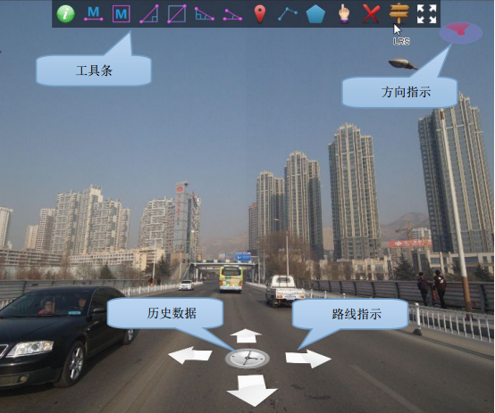
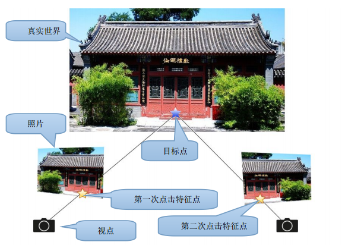

## 功能说明

### 主界面

### 操作方式

#### 视图浏览

> TIP: 注意所有键盘事件的keymap都可在实景初始化时配置。

- 滚轮 前进、后退
- 方向箭头 前进、后退
- 翻页键 快进、快退
- 空格键 播放、停止播放
- F9 全屏
- 路线指示箭头 前进、转换路线
- 历史数据 查看、转换历史帧

#### 定位操作

> 采集线、面，测量长度、面积

| 键位 | 功能 |
| :---: | :---: |
| 左键 | 添加节点 |
| 中键 | 撤销一步 |
| 右键 | 完成 |

#### 采样模式

##### 摄影测量法

> 在第一帧照片上点取一个特征，自动切换到下一帧，并显示一条绿色辅助线，再次点击特征点，完成定位。

注意：摄影测量法操作原则
1. 只能测量静态物体，不能测量运动物体
2. 尽量在物体最近的距离测量，以免误差放大
3. 尽量放大图像，点击位置精确到像素
4. 找到明确的特征点，比如顶点、角点、交点、文字或图案。不要用在杆体、标线等
无法重复定位的特征
5. 不要测量重复的物体，比如栅栏的中段，因为到第二张照片上很难确定第一张照片
点击的位置

##### 地面采样法

> 如果帧数据包含地面高度信息，可以使用地面采样模式，在一帧照片上点击一次，完成
  定位
  
注意：地面采样法只能采集地面上的对象，不能采集高于、低于地面的对象。而且定
位精度较差